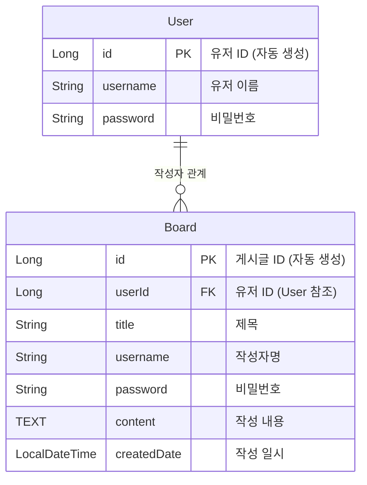

```mermaid
    erDiagram
    Board {
        Long id PK "게시글 ID (자동 생성)"
        Long userId FK "유저 ID (User 참조)"
        String title "제목"
        String username "작성자명"
        String password "비밀번호"
        TEXT content "작성 내용"
        LocalDateTime createdDate "작성 일시"
    }

    User {
        Long id PK "유저 ID (자동 생성)"
        String username "유저 이름"
        String password "비밀번호"
    }

    User ||--o{ Board: "작성자 관계"
```